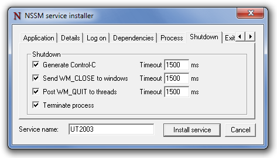
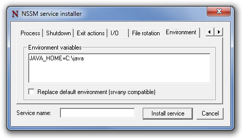

<h1>NSSM - the Non-Sucking Service Manager</h1>

<h3>Usage</h3>

No &quot;installation&quot; of <em>nssm</em> is needed.  Just place it
somewhere on the system (preferably somewhere in your PATH) and run it.

Note however that <em>nssm</em> registers itself as an Event Log message
source which means that running multiple instances or different version of
<em>nssm</em> from different locations may cause confusion.  Also note that if
you run the Event Viewer it will open the <em>nssm</em> executable, preventing
you from overwriting it.  Keep this in mind if you come to upgrade
<em>nssm</em>.

<em>Some features are labelled as supported as of a particular version.
If the version described is newer than that available from the
<a href="/download">download</a> page there may be a pre-release
<a href="/builds">build</a> with the feature enabled.</em>

<em>Equivalent command</em> examples below show the
<a href="/commands">commands</a> which would configure an <em>existing</em>
service to match the screenshots.  In many cases they represent the defaults
for the parameters in question and are thus redundant.  Any parameter can
also be reset to its default value with

<pre class="code">nssm reset &lt;servicename&gt; &lt;parameter&gt;</pre>

<h3>Installing a service</h3>

You can use <em>nssm</em> to install a service.  The command to type is:

<pre class="code">nssm install &lt;servicename&gt;</pre>

The installer consists of several tabs with lots of configurable
parameters.  Most are preset to <em>nssm</em>'s defaults, so it's possible to
install a service without leaving the <em>Application</em> tab.

<h4>Application tab</h4>

The <em>Path</em> to the application (or script) you want to run and is
the only mandatory field.  If the application needs to start in a particular
directory you can enter it in the <em>Startup directory</em> field.  If the
field is left blank the default startup directory will be the directory
containing the application.  The <em>Arguments</em> field can be used to
specify any commandline arguments to pass to the application.

The screenshot below shows installation of a
<a href="http://www.unrealtournament2003.com/">UT2003</a> server.  The command
to run such a service is <strong>ucc server</strong> so the full path
to <strong>UCC.exe</strong> is entered under <em>Path</em> and
<strong>server</strong> is entered under <em>Options</em>.

Equivalent <a href="/commands">commands</a>:

<pre class="code">nssm set UT2003 Application C:\games\ut2003\System\UCC.exe</pre>
<pre class="code">nssm set UT2003 AppDirectory C:\games\ut2003\System</pre>
<pre class="code">nssm set UT2003 AppParameters server</pre>

Clicking <em>Install service</em> completes the installation of the
service.

<h4>Details tab</h4>

The <em>Details</em> tab lists system details about the service.

Equivalent <a href="/commands">commands</a>:

<pre class="code">nssm set UT2003 DisplayName UT2k3</pre>
<pre class="code">nssm set UT2003 Description Unreal Tournament 2003</pre>
<pre class="code">nssm set UT2003 Start SERVICE_AUTO_START</pre>

<h4>Log on tab</h4>

The <em>Log on</em> tab can be used to manage the user account which will
run the service.  <em>nssm</em> will automatically ensure that the account
you choose has the necessary <em>log on as a service</em> permissions.

Equivalent <a href="/commands">commands</a>:

<pre class="code">nssm set UT2003 ObjectName LocalSystem</pre>
<pre class="code">nssm set UT2003 Type SERVICE_WIN32_OWN_PROCESS</pre>

Refer to the <a href="/commands#exceptions">command line usage</a>
documentation for details on configuring an account and password on the
command line.  If you need to configure a blank password you <em>must</em>
use the command line.

<h4>Dependencies</h4>

The <em>Dependencies</em> tab lists any services or service groups which
must be started before the the service can run.

You can enter service names or display names, one per line.  Service
group names must be preceded by the SC_GROUP_IDENTIFIER prefix (the +
symbol).

Equivalent <a href="/commands">commands</a>:

<pre class="code">nssm set UT2003 DependOnService MpsSvc</pre>

<h4>Process tab</h4>

The <em>Process</em> tab can be used to set <a href="#process">process</a>
priority and CPU affinity for the application.  By default the application will
run with normal priority and be allowed to execute on all CPUs.  If you wish to
restrict the process to a subset of available CPUs, uncheck &quot;All
processors&quot; and select the CPU(s) as desired.

Process priority and affinity can be changed from the Windows task
manager while the service is running.

Equivalent <a href="/commands">commands</a>:

<pre class="code">nssm set UT2003 AppPriority NORMAL_PRIORITY_CLASS</pre>
<pre class="code">nssm set UT2003 AppNoConsole 0</pre>
<pre class="code">nssm set UT2003 AppAffinity All</pre>

<h4>Shutdown tab</h4>

The <em>Shutdown</em> tab lists the various <a href="#shutdown">stop methods
and timeouts</a> used when tidying up the application after a crash or when the
service is gracefully stopped.

Equivalent <a href="/commands">commands</a>:

<pre class="code">nssm set UT2003 AppStopMethodSkip 0</pre>
<pre class="code">nssm set UT2003 AppStopMethodConsole 1500</pre>
<pre class="code">nssm set UT2003 AppStopMethodWindow 1500</pre>
<pre class="code">nssm set UT2003 AppStopMethodThreads 1500</pre>

<h4>Exit actions tab</h4>

The <em>Exit actions</em> tab can be used to tweak the
<a href="#throttling">restart throttling</a> and default
<a href="#exit">action on exit</a> for the service.  You can also specify a
<a href="#delay">mandatory delay</a> between automatic restarts of the
application.

To configure exit actions for specific application exit codes you must use
the registry as described <a href="#exit">below</a>.

Equivalent <a href="/commands">commands</a>:

<pre class="code">nssm set UT2003 AppThrottle 1500</pre>
<pre class="code">nssm set UT2003 AppExit Default Restart</pre>
<pre class="code">nssm set UT2003 AppRestartDelay 0</pre>

<h4>I/O tab</h4>

The <em>I/O</em> tab can be used to specify the input and/or output files
used when <a href="#io">I/O redirection</a> is enabled.  Setting
<em>Output</em> and <em>Error</em> is usually sufficient to capture log
messages generated by the application.

Configure I/O in the registry as described <a href="#io">below</a> for more
control over paths and access modes.

Equivalent <a href="/commands">commands</a>:

<pre class="code">nssm set UT2003 AppStdout C:\games\ut2003\service.log</pre>
<pre class="code">nssm set UT2003 AppStderr C:\games\ut2003\service.log</pre>

<h4>File rotation tab</h4>

The <em>File rotation</em> tab can be used in conjunction with
<a href="#io">I/O</a> settings to configure <a href="#rotation">rotation</a> of
output files when the service restarts.

If the <em>Replace existing Output and/or Error files</em> checkbox
is checked, <em>nssm</em> will overwrite existing output files when starting
the service.  The default is to append to any existing files.  If the
<em>Rotate files</em> checkbox is checked, <em>nssm</em> will rename existing
files prior to setting up I/O redirection.  Use the <em>Restrict rotation</em>
fields to disable file rotation for files which have been modified more
recently than the specified number of <em>seconds</em> or are smaller than
the specified number of <em>kilobytes</em>.

By default <em>nssm</em> only performs file rotation when the service
(re)starts.  To enable rotation of files which grow to the specified size
limit while the service is running, check the <em>Rotate while service is
running</em> checkbox.  Online rotation ignores any configured file age
limit.

Danger, moving parts!  Online rotation requires <em>nssm</em> to intercept
the application's output and write the files itself.  Increased complexity
necessarily leads to increased risk of failure.

Equivalent <a href="/commands">commands</a>:

<pre class="code">nssm set UT2003 AppStdoutCreationDisposition 4</pre>
<pre class="code">nssm set UT2003 AppStderrCreationDisposition 4</pre>
<pre class="code">nssm set UT2003 AppRotateFiles 1</pre>
<pre class="code">nssm set UT2003 AppRotateOnline 0</pre>
<pre class="code">nssm set UT2003 AppRotateSeconds 86400</pre>
<pre class="code">nssm set UT2003 AppRotateBytes 1048576</pre>

<h4>Environment tab</h4>

The <em>Environment</em> tab can be used to specify a newline-separated list
of <a href="#environment">environment variables</a> to pass to the application.
If the <em>Replace default environment</em> checkbox is checked the variables
specified will be the <em>only</em> ones passed to the service.  When it is
left unchecked (the default), the environment created at service startup will be
preserved.

Equivalent <a href="/commands">commands</a>:

<pre class="code">nssm set &lt;servicename&gt; AppEnvironmentExtra JAVA_HOME=C:\java</pre>

<h4>Installing from the command line</h4>

As of version 2.0 you can also bypass the GUI and install a service from
the command line.  The syntax is:

<pre class="code">nssm install &lt;servicename&gt; &lt;application&gt; [&lt;options&gt;]</pre>

Please note that the actual program entered into the services database is
<em>nssm</em> itself so you must not move or delete <em>nssm.exe</em> after
installing a service.  If you do wish to change the path to <em>nssm.exe</em>
you can either remove and reinstall the service or edit
<strong>HKLM\System\CurrentControlSet\Services\<em>servicename</em>\ImagePath</strong>
to reflect the new location.

<h4>Quoting issues</h4>

<em>nssm</em> correctly handles paths with spaces but passing arguments to
it can be tricky because of how the command prompt works.

If the path to the application contains spaces you will need to enclose it
in quotes otherwise the command prompt will interpret the path as <em>two</em>
arguments.

<pre class="code">nssm install &lt;servicename&gt; &quot;C:\Program Files\app.exe&quot;</pre>

If one of the options you wish to provide contains spaces, you will need to
quote that too <em>and</em> quote the quotation marks themselves.

<pre class="code">nssm install &lt;servicename&gt; &lt;application&gt; &quot;&quot;&quot;This is one argument&quot;&quot;&quot;</pre>

Isaballa Sanfelipo suggests a method of installing a Java application from a
batch file.

<pre class="code">nssm install solr &quot;%JavaExe%&quot; -Dsolr.solr.home=&quot;\&quot;%CD%\solr&quot;\&quot;
-Djetty.home=&quot;\&quot;%CD%&quot;\&quot; -Djetty.logs=&quot;\&quot;%CD%\logs&quot;\&quot; -cp
&quot;\&quot;%CD%\lib\*.jar&quot;\&quot;;&quot;\&quot;%CD%\start.jar&quot;\&quot; -jar &quot;\&quot;%CD%\start.jar&quot;\&quot;</pre>

John Duffy needed to pass quotes through to the parameter list.

<pre class="code">nssm set NodeServer3000 AppParameters &quot;&quot;&quot;&quot;&quot;&quot;&quot;$Env:NODE_JS_NPM&quot;&quot;&quot;&quot;&quot;&quot; start&quot;</pre>

<h3>Removing a service</h3>

The command to remove a service is:

<pre class="code">nssm remove &lt;servicename&gt;</pre>

A confirmation window is displayed before the service is removed.

As of version 2.0 you can also remove services from the command line viz:

<pre class="code">nssm remove &lt;servicename&gt; confirm</pre>

<em>nssm</em> will happily try to remove any service, not just ones
<em>nssm</em> itself manages.  Try not to delete services you shouldn't...

<h3>Service shutdown</h3>

When <em>nssm</em> receives a stop command from the Windows service manager,
or when it detects that the monitored application has exited, it tries to shut
down the monitored application, and any subprocesses, gracefully.  If the
application's process tree does not exit promptly, <em>nssm</em> can forcibly
terminate all processes and subprocesses belonging to the application.

There are four stages which <em>nssm</em> can use to shut down the
application, and by default it will attempt all four in order.  It is possible
(though not recommended) to disable some or all of the methods from being
used.  Different applications will respond differently to the various
requests, so leaving them all enabled is usually the best way to ensure that
the application shuts down gracefully.

First <em>nssm</em> will attempt to generate a Control-C event and send it
to the application's console.  Batch scripts or console applications may
intercept the event and shut themselves down gracefully.  Java applications
tend to respond well to Control-C events.  GUI applications do not have
consoles and will not respond to this method.  <em>Not supported on Windows
2000.</em>

Secondly <em>nssm</em> will enumerate all windows created by the application
and send them a <em>WM_CLOSE</em> message.  Applications may follow the
convention of responding to the message by initiating a graceful exit.

Thirdly <em>nssm</em> will enumerate all threads created by the application
and send them a <em>WM_QUIT</em> message, which will be received if the
application has a thread message queue.

As a last resort <em>nssm</em> can call <code>TerminateProcess()</code> to
request that the operating system forcibly terminate the application.
The <code>TerminateProcess()</code> call cannot be trapped or ignored, so in
most circumstances the application will be killed.  However, it is unlikely
that it will be able to perform any cleanup operations before it exits.

To disable any of the methods above, create an integer (REG_DWORD) value
<strong>HKLM\System\CurrentControlSet\Services\<em>servicename</em>\Parameters\AppStopMethodSkip</strong>
and set it to the sum of one or more of the numbers below.

<ul>
<li>
<strong>1</strong> - Don't send Control-C to the console.
</li>
<li>
<strong>2</strong> - Don't send WM_CLOSE to windows.
</li>
<li>
<strong>4</strong> - Don't send WM_QUIT to threads.
</li>
<li>
<strong>8</strong> - Don't call TerminateProcess().
</li>
</ul>

If, for example, you knew that an application did not respond to Control-C
and did not have a thread message queue, you could set
<em>AppStopMethodSkip</em> to 5.

It is highly recommended <strong>not</strong> to disable the
<code>TerminateProcess()</code> call.  When the service is stopped
<em>nssm</em> will exit.  If the application is not terminated before that
happens it may continue running and <em>nssm</em> will no longer be able to
control it.

By default <em>nssm</em> will wait up to 1500 milliseconds for the
application to exit after trying each of the methods described above.  The
timeout can be configured on a per-method basis by creating integer (REG_DWORD)
values under
<strong>HKLM\System\CurrentControlSet\Services\<em>servicename</em>\Parameters</strong>
in the registry and setting them to the desired number of milliseconds to wait.

<ul>
<li>
<strong>AppStopMethodConsole</strong> - Time to wait after sending Control-C.
</li>
<li>
<strong>AppStopMethodWindow</strong> - Time to wait after sending WM_CLOSE.
</li>
<li>
<strong>AppStopMethodThreads</strong> - Time to wait after sending WM_QUIT.
</li>
</ul>

Note that the timeout applies to all processes spawned by the application so
the total timeout may be longer than expected if the application has multiple
subprocesses.

<h3>Actions on exit</h3>

To configure the action which <em>nssm</em> should take when the application
exits, edit the default value of the key
<strong>HKLM\System\CurrentControlSet\Services\<em>servicename</em>\Parameters\AppExit</strong>.
If the key does not exist in the registry when <em>nssm</em> runs it will
create it and set the value to <strong>Restart</strong>.  Change it to either
<strong>Ignore</strong> or <strong>Exit</strong> to specify the action taken.
<em>nssm</em> will only create this key if it doesn't already exist.  Your
changes will not be overridden.

To specify a different action for particular exit codes, create a string
(REG_SZ) value underneath the <strong>AppExit</strong> key whose name is the
exit code being considered.  For example to stop the service on an exit code of
0 (which usually means the application finished successfully), create
<strong>HKLM\System\CurrentControlSet\Services\<em>servicename</em>\Parameters\AppExit\0</strong>
and set it to <strong>Exit</strong>.  Look in the Event Log for messages from
<em>nssm</em> to see what exit codes are returned by your application.

If your application's exit code does not correspond to a registry entry,
<em>nssm</em> will use the default value of <strong>AppExit</strong> when
deciding what to do.

<h3>Restart delay</h3>

As of version 2.22, <em>nssm</em> can apply a mandatory delay between
restarts of the application.  This could be used, for example, to run a command
at regular intervals such as an hourly batch script.

To specify a restart delay, create an integer (REG_DWORD) value
<strong>HKLM\System\CurrentControlSet\Services\<em>servicename</em>\Parameters\AppRestartDelay</strong>
and set it to the number of milliseconds to wait between restarts.

The service will report its state as Paused while waiting for the next
restart.  Sending it a Continue control will temporarily cancel the delay and
trigger a restart immediately.

Please see the section on <a name="#throttling">restart throttling</a> below
for notes on how <em>nssm</em> works when both throttling and restart delays
are configured.

<h3>Restart throttling</h3>

To avoid a tight CPU loop, <em>nssm</em> will throttle restarts of the
service if the monitored application exits too soon after starting.  By
default a threshold of 1500 milliseconds is used.  To specify a different
value, create an integer (REG_DWORD) value
<strong>HKLM\System\CurrentControlSet\Services\<em>servicename</em>\Parameters\AppThrottle</strong>
and set it to the required number of milliseconds.

The first restart will be attempted with no delay.  If the restarted
application continues to exit before running for the threshold amount of
milliseconds, <em>nssm</em> will pause for at least 2000 milliseconds, doubling
the pause time for each subsequent failure.  The maximum time it will pause is
256000 milliseconds, around four minutes.  The delay counter is reset when the
service successfully runs for at least the threshold time.

If you determine why the service failed and take action to correct the
problem, you can send a Continue control to the service, which will be shown as
Paused.  In this way you can avoid having to wait for the next restart
attempt.

When a <a href="#delay">restart delay</a> is configured and the application
exits prematurely, <em>nssm</em> will throttle the restart by whichever is
<em>longer</em> of the configured delay and calculated throttle time.  If, for
instance, you configured a restart delay of 3000 milliseconds and the service
failed on each startup, the first restart attempt would be delayed by 3000
milliseconds because 3000ms configured is longer than 0ms from throttling.
The second attempt would also be delayed by 3000 milliseconds; 3000ms
configured is again longer than 2000ms from throttling.  The third attempt
would be delayed by 4000 milliseconds; longer than the configured 3000ms.

For this reason, if you intend to use a restart delay to configure a
short-running service which repeats at an interval less than five minutes,
you should consider lowering the value of <strong>AppThrottle</strong>.

<h3>Process priority and CPU affinity</h3>

As of version 2.22, <em>nssm</em> can manage the CPU affinity and process
priority of the managed application.

By default application will be launched with normal process priority and
be allowed to execute on any CPU.  <em>nssm</em> will look under
<strong>HKLM\System\CurrentControlSet\Services\<em>servicename</em>\Parameters</strong>
for registry entries to configure the application startup.

If the integer (REG_DWORD) value <strong>AppPriority</strong> is set,
<em>nssm</em> will interpret its value as an argument to
<code>SetPriorityClass()</code> and start the application with the specified
priority.

If the string (REG_SZ) value <strong>AppAffinity</strong> is set,
<em>nssm</em> will interpret it as a comma-separated list of CPU IDs, starting
from <em>0</em> on which the application can run.  Alternatively, a range of
IDs may be specified by separating the indices with a dash.

Only digits, dashes and commas are valid in an affinity string.

For example, the the string <em>0-2,4</em> specifies that the application
may run on the first, second, third and fifth CPUs in the system.

<h3>Console window</h3>

As of version 2.22, <em>nssm</em> will by default create a new console
window for the application.  This allows some programs to work which would
otherwise fail, such as those which expect to be able to read user input.  The
console window can be disabled if it is not needed by setting the integer
(REG_DWORD) value <strong>AppNoConsole</strong> under
<strong>HKLM\System\CurrentControlSet\Services\<em>servicename</em>\Parameters</strong>
to a non-zero value.

<h3>I/O redirection</h3>

<em>nssm</em> can redirect the managed application's I/O to any path
capable of being opened by <code>CreateFile()</code>.  This feature may be
useful if your application expects to be able to log to the console.

<em>nssm</em> will look under
<strong>HKLM\System\CurrentControlSet\Services\<em>servicename</em>\Parameters</strong>
for keys corresponding to arguments to <code>CreateFile()</code>.  All are
optional.  If no path is given for a particular stream it will not be
redirected.  If a path is given but any of the other values they will receive
sensible defaults.

<ul>
<li>
<strong>AppStdin</strong> (string) - Path to receive input.
</li>
<li>
<strong>AppStdinShareMode</strong> (integer) - <code>ShareMode</code>
argument for the input.
</li>
<li>
<strong>AppStdinCreationDisposition</strong> (integer) - <code>CreationDisposition</code>
argument for the input.
</li>
<li>
<strong>AppStdinFlagsAndAttributes</strong> (integer) - <code>FlagsAndAttributes</code>
argument for the input.
</li>
<li>
<strong>AppStdout</strong> (string) - Path to receive output.
</li>
<li>
<strong>AppStdoutShareMode</strong> (integer) - <code>ShareMode</code>
argument for the output.
</li>
<li>
<strong>AppStdoutCreationDisposition</strong> (integer) - <code>CreationDisposition</code>
argument for the output.
</li>
<li>
<strong>AppStdoutFlagsAndAttributes</strong> (integer) - <code>FlagsAndAttributes</code>
argument for the output.
</li>
<li>
<strong>AppStderr</strong> (string) - Path to receive error output.
</li>
<li>
<strong>AppStderrShareMode</strong> (integer) - <code>ShareMode</code>
argument for the error output.
</li>
<li>
<strong>AppStderrCreationDisposition</strong> (integer) - <code>CreationDisposition</code>
argument for the error output.
</li>
<li>
<strong>AppStderrFlagsAndAttributes</strong> (integer) - <code>FlagsAndAttributes</code>
argument for the error output.
</li>
</ul>

In general it is advisable to set both <strong>AppStdout</strong> and
<strong>AppStderr</strong> in order to log output, as applications may log
informational and error messages separately.

It is possible to direct both stderr and stdout to the same path but due to
a limitation with <em>nssm</em> you must provide the <em>exact</em> same string
in both the <strong>AppStdout</strong> and <strong>AppStderr</strong> registry
values.  Only if the two entries are <em>the same</em> will <em>nssm</em> be
able to interleave the two streams.

<h3>File rotation</h3>

As of version 2.22, if <a href="#io">I/O redirection</a> is enabled,
<em>nssm</em> can rotate existing output files prior to launching the
application.  <em>nssm</em> can also rotate files while the service is running.
See <a href="#online_rotation">online rotation</a> below.

To enable rotation, create an integer (REG_DWORD) value
<strong>HKLM\System\CurrentControlSet\Services\<em>servicename</em>\Parameters\AppRotate</strong>
and set it to 1.  Before (re)starting the service, <em>nssm</em> will rotate
the file(s) configured in <strong>AppStdout</strong> and/or
<strong>AppStderr</strong> if they already exist.

Existing files will be renamed according to a template which uses the last
modification time of the file.  For example, <em>C:\Services\myservice.log</em>
might be rotated to <em>C:\Services\myservice-20140114T180840.953.log</em>.

Note that the timestamp is in ISO8601 format, so a list of rotated files
sorted by name will show the oldest file first, and that it includes a
millisecond part, so that files will not be lost if the service exits and is
restarted in less than a second.

Two additional registry settings under
<strong>HKLM\System\CurrentControlSet\Services\<em>servicename</em>\Parameters</strong>
can be used to tweak how <em>nssm</em> rotates files.

If the integer (REG_DWORD) value <strong>AppRotateSeconds</strong> is set,
<em>nssm</em> will not rotate any file which was last modified <em>less</em>
than the configured number of seconds ago.

If the integer (REG_DWORD) value <strong>AppRotateBytes</strong> is set,
<em>nssm</em> will not rotate any file which is <em>smaller</em> than the
configured number of bytes.  <em>nssm</em> can also handle files whose size is
too large to be expressed in 32-bits, in case you decide that it's fine for a
log file to grow to 4GB in size but any more is just <em>too big</em>.  The
value of <strong>AppRotateBytesHigh</strong> will be interpreted as the high
order part of a 64-bit size.

If both <strong>AppRotateSeconds</strong> and
<strong>AppRotateBytes(High)</strong> are set, <em>nssm</em> will require that
both criteria are met for a file to be rotated.

<h4>Online rotation</h4>

If the integer (REG_DWORD) value <strong>AppRotateOnline</strong> is set to
1, <em>nssm</em> can rotate files which grow to the configured file size limit
while the service is running.  The value of <strong>AppRotateSeconds</strong>
is ignored for the purposes of online rotation, though it will still apply for
rotation before the service (re)starts.

<strong>AppRotateOnline</strong> is ignored if <strong>AppRotate</strong> is
not set.

When online rotation is enabled, <em>nssm</em> reads the application's
stdout and/or stderr and writes the output files itself.  Doing so introduces
a degree of complexity compared to simple I/O redirection, so should not be
used for services which do not require it.  Although <em>nssm</em> will try to
handle I/O errors gracefully, if something goes wrong it is possible for
output from the application to be lost until the service is restarted.  See the
<a href="#io_technical">technical discussion</a> for more details about how
<em>nssm</em> handles I/O redirection.

<h4>On-demand rotation</h4>

<em>nssm</em> can rotate output files on-demand, regardless of whether or
not they have hit the configured size limit.  To request file rotation for a
service, send user-defined service control 128 or run the
<a href="/commands">command</a>:

<pre class="code">nssm rotate &lt;servicename&gt;</pre>

A limitation of on-demand rotation is that the actual file renaming won't
happen until after the next line of input has been read from the application.
For that reason there may be a considerable delay between issuing the rotation
request and the rotation taking place, depending on how verbose the application
is.

On-demand rotation will work even if <strong>AppRotateBytes</strong> is not
configured, ie if the service would not rotate files while running.  It will
not work, however, unless both <strong>AppRotate</strong> and
<strong>AppRotateOnline</strong> are configured.

<h3>I/O redirection technical details</h3>

There are three cases to consider when looking at how a service handles
I/O.

<h4>No redirection</h4>

In the simplest case, <em>nssm</em> is not configured with any I/O
redirection.  It will launch the application with stdin, stdout and stderr
connected to a console instance.  If the service runs under the LOCALSYSTEM
account and is configured to interact with the desktop, you may be able to
view the output directly.

<h4>I/O redirected; online rotation disabled</h4>

If stdout and/or stderr are redirected and online rotation is disabled,
<em>nssm</em> will call <code>CreateFile()</code> to open a handle for each
I/O stream, then call <code>DuplicateHandle()</code> to set a copy of the
handle in the <code>STARTUPINFO</code> datastructure passed to
<code>CreateProcess()</code>.  Thus the application will run with an open
handle to the file whereas <em>nssm</em> itself has no open handles.

<h4>I/O redirected; online rotation enabled</h4>

This case is by far the most complex of the three and is thus necessarily
most at risk of something going wrong, potentially resulting in the loss of
output from the application.

<em>nssm</em> first calls <code>CreateFile()</code> just as in the
previous case.  It then calls <code>CreatePipe()</code> to open an anonymous
pipe.  The reading end of the pipe and the handle to the output file are
passed to a new thread which does the actual writing.  The writing end of
the pipe is duplicated with <code>DuplicateHandle()</code> for passing to
<code>CreateProcess()</code>.  Thus the application will run with an
open handle to one end of the pipe and <em>nssm</em> will run with a handle
to the other end of the pipe and a handle to the output file.

The writing thread runs a simple loop wherein it reads data from the
pipe, ie the application's output, into a buffer with <code>ReadFile()</code>
then writes the contents of that buffer to the output file with
<code>WriteFile()</code>.  If the file hits the configured size limit
the thread will write up to the next newline, close its output handle, rotate
the file and open a new handle to continue writing to the new file.

When <em>nssm</em> receives an on-demand rotation request it will set a
flag which instructs the writing thread to perform a rotation after the next
<code>ReadFile()</code> call completes, regardless of the file size.  Because
<code>ReadFile()</code> blocks execution until something is read,
<em>nssm</em> won't actually get round to rotating the file until the
application produces the next line of output.

<em>nssm</em> doesn't know whether the output from the application will be
Unicode or ANSI, so prior to writing the first data to the file, or to
rotating, it calls <code>IsTextUnicode()</code> to try to determine the text
encoding that's in use.  If it (looks like it) is Unicode, <em>nssm</em>
writes a UTF-16 byte-order marker to the beginning of the new file so that
it will be read correctly when opened with a text editor.

If both stdout and stderr are redirected, and to separate files,
<em>nssm</em> will spawn a writing thread for each.  <em>nssm</em> will deal
with an application which writes stdout in Unicode and stderr in ANSI - or
vice versa - if you are unfortunate (or evil) enough to run one.

It should be clear from the above that there are a number of pitfalls to
online rotation.  <em>nssm</em> will try to deal gracefully with any problems
during the I/O process but to be safe you should consider not using online
rotation unless your output is so voluminous that you have no choice.

<h3>Environment variables</h3>

As of version 2.11, <em>nssm</em> respects the
<strong>AppEnvironment</strong> registry value supported by <em>srvany</em>.
To specify a list of environment variables to pass to the monitored application,
create a multi-valued string (REG_MULTI_SZ) value
<strong>HKLM\System\CurrentControlSet\Services\<em>servicename</em>\Parameters\AppEnvironment</strong>
where each entry is of the form <em>KEY=VALUE</em>.

It is possible to omit the <em>VALUE</em> if you just want the environment
variable <em>KEY</em> to exist but the <em>=</em> symbol is mandatory.  <em>The
service will not run if an invalid environment is specified!</em>

As of version 2.19, <em>nssm</em> also respects the
<strong>AppEnvironmentExtra</strong> registry value, which should have the same
format as <strong>AppEnvironment</strong>.  Environment variables set in
<strong>AppEnvironmentExtra</strong> will be <em>added</em> to the service's
default environment.

For compatibility with <em>srvany</em>, the environment variables specified
in <strong>AppEnvironment</strong> will <em>replace</em> those set by the system
at service startup.  Since that probably isn't what you want, use
<strong>AppEnvironmentExtra</strong> instead.

